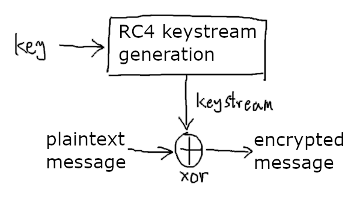

# Crypto - Encryption Factory Writeup

## Background

To learn more about ASCII, Hexadecimal encoding and XOR, try some simple general challenges on [CryptoHack](https://cryptohack.org/challenges/general/)

### Python packages

It is suggested to install these packages inside a Python virtual environment

1. To run the challenge, PyCryptodome needs to be installed, e.g. `pip install pycryptodome`. You do not need it to solve the challenge though

2. The solving script uses `xor` in pwntools to xor two `bytes` objects, you can also write your own code to do so

### Hexadecimal

The encrypted data are oftentimes non printable. In the challenge, to share it in a JSON file, it is represented in hexadecimal. To convert them into bytes in Python, use `bytes.fromhex(some_hexadecimal_string)`

### XOR

*Some of this part is modified from [CryptoHack](https://cryptohack.org/challenges/general/)*

XOR is a bitwise operator which returns 0 if the bits are the same, and 1 otherwise. The XOR operator is denoted by ⊕, but in many programming languages uses the caret ^ instead

|A|B|Output|
|-|-|------|
|0|0|0|
|0|1|1|
|1|0|1|
|1|1|0|

Each byte can be represented as a number of 0 to 255 (inclusive). To XOR those numbers, convert them into binary (with 0s padded to the left), then XOR each bit

#### XOR properties

1. XOR is commutative and associative
2. A ⊕ B ⊕ B = A

## What does the code do?

It generates a random key. It uses RC4 to encrypt a message, and then encrypt the flag.

The message is given in the code. The encrypted message and flag is given in the output file.

## RC4 Encryption

RC4 is also known as ARC4 (that's why you see ARC4 in the code, but I kept mentioning RC4).

RC4 is a stream cipher, and it generates a "keystream" derived from the key (in this challenge, we do not care about how the keystream is derived). but with the same key, it will generate the same keystream.

To encrypt a message using RC4, it will XOR the keystream with the message. To decrypt, it XOR the same keystream with the encrypted message.

```
encrypted_message = plaintext_message ⊕ keystream
```



## Challenge Solution

Both the message and flag are encrypted with the same key, thus same keystream. To decrypt the flag, just need to XOR the keystream with encrypted flag.

The encrypted message is generated by XORing the keystream with the plaintext message. To get the keystream back, just need to XOR the encrypted message with the plaintext again.

```
keystream = plaintext_message ⊕ keystream ⊕ plaintext_message
```

XOR the encrypted flag with the keystream, get the flag `minictf{i_gu3ss_w3_using_th3_s4m3_k3y5tr34m_n0w}`. Full solving script can be found at [solution.py](solution.py).
