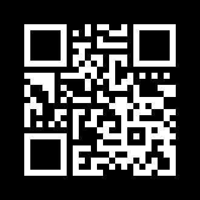

# QReative` Challenge

## Topics Covered

* Gimp

## Tools

* Any photo editing image editing software really

## Method

This was a corrupted QR code, to fix if you needed to inverse the colours and draw in the alignment boxes (in black). Using your phone or some other read you can scan the fixed QR code to get the flag value:

"sigint>Sp00py_Sk3let0ns"

